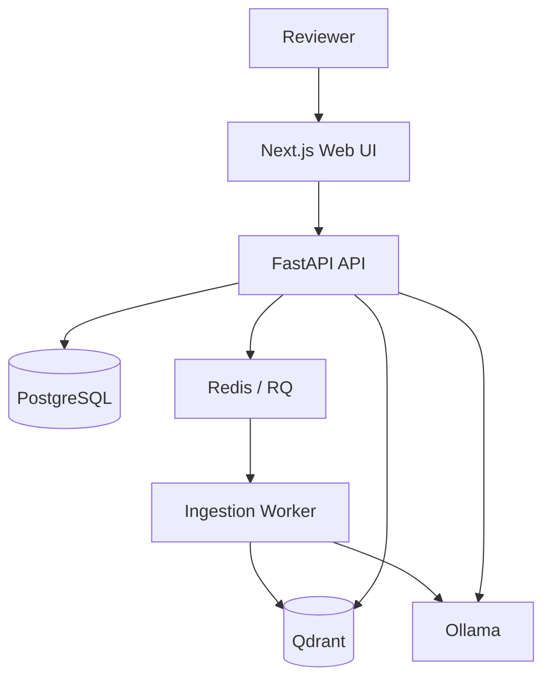

# AccrediLens Architecture

AccrediLens is a local-first retrieval-augmented generation (RAG) system for accreditation evidence. Institutional documents remain on the operator's machine; generated answers are grounded in retrieved passages and retain source metadata for human verification.

## System context

## Components

| Component | Responsibility | Default address |
|---|---|---|
| Next.js frontend | Authentication, evidence library, upload, Q&A and citations | `http://localhost:3001` |
| FastAPI backend | REST API, authorization, orchestration and health endpoint | `http://127.0.0.1:8000` |
| PostgreSQL | Users, documents, metadata and application state | `localhost:5432` |
| Redis + RQ | Background ingestion queue | `localhost:6379` |
| Qdrant | Document-chunk vectors and similarity retrieval | `localhost:6333` |
| Ollama | Local embeddings and language-model inference | `localhost:11434` |
| RQ worker | PDF extraction, chunking, embedding and indexing | local process |

## Evidence ingestion

1. The authenticated reviewer uploads a text-based PDF.
2. FastAPI stores the upload and records metadata in PostgreSQL.
3. A background RQ job extracts text with PyMuPDF/pdfplumber.
4. The worker creates traceable chunks with page and paragraph metadata.
5. Ollama generates local embeddings.
6. Qdrant stores vectors and source metadata.
7. The evidence library exposes processing state to the reviewer.

## Grounded answer flow

1. The reviewer submits a question or accreditation criterion.
2. The backend embeds the query and retrieves relevant Qdrant chunks.
3. Retrieved passages are filtered and assembled into bounded context.
4. Ollama generates an answer from that context.
5. The API returns the answer with page-, section-, paragraph- and chunk-level references.
6. The reviewer verifies the cited evidence; AccrediLens does not make autonomous accreditation decisions.

## Trust boundaries

- Browser tokens cross the frontend/API boundary and are validated by FastAPI.
- Evidence files, database records, vectors and model inference remain local by default.
- `.env` files, credentials, uploads, databases and model binaries are excluded from Git.
- CORS permits the configured frontend origin only.
- Human review is mandatory because model output can be incomplete or incorrect.

## Runtime lifecycle

On Windows, `turn-on.ps1` validates prerequisites, starts Docker dependencies, starts Ollama when needed, launches the API, worker and frontend, and verifies the public health endpoints. `turn-off.ps1` stops the application processes and Docker services.

For manual troubleshooting, each component can be started independently using the commands in [README.md](README.md).

## CI boundary

GitHub Actions validates reproducibility without requiring model downloads or live institutional data. CI checks Docker Compose configuration, Python dependencies and syntax, PowerShell launcher syntax, TypeScript, ESLint and the production Next.js build. Full RAG inference remains a local integration test because it requires Ollama models and persistent services.
